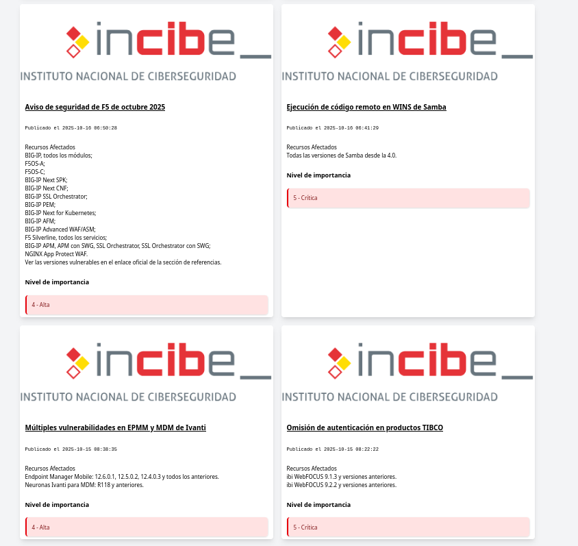

## Proyecto de Visualización de Feed RSS de INCIBE-CERT



### Descripción del Proyecto
Este script JavaScript permite obtener y mostrar dinámicamente las alertas de seguridad del feed RSS de INCIBE-CERT (Instituto Nacional de Ciberseguridad de España) utilizando la API de RSS2JSON.

### Características Principales
- **Obtención de Feed RSS**: Recupera alertas desde la URL de INCIBE-CERT
- **Procesamiento Dinámico**: Genera contenido HTML para cada alerta
- **Diseño Responsivo**: Utiliza clases de Tailwind CSS para estilización
- **Manejo de Errores**: Incluye gestión de errores en la carga del feed

### Requisitos
- Navegador web moderno con soporte para JavaScript
- Conexión a Internet
- Biblioteca Tailwind CSS (para estilos)

### Funcionalidades Clave

| Función | Descripción | Detalles |
|---------|-------------|----------|
| `cargarFeed()` | Recupera el feed RSS | Utiliza fetch API con RSS2JSON |
| `mostrarFeed(items)` | Renderiza las alertas | Crea elementos HTML dinámicamente |
| Procesamiento de Contenido | Extrae información específica | Maneja recursos afectados e importancia |

### Uso
1. Incluir el script en un documento HTML
2. Asegurar la existencia de un contenedor con ID `blog-feed`
3. Llamar a `cargarFeed()` al cargar la página

### Consideraciones Técnicas
- **API**: Usa `https://api.rss2json.com/v1/api.json`
- **Fuente Original**: `https://www.incibe.es/index.php/incibe-cert/alerta-temprana/avisos/feed`
- **Manejo de Errores**: Registro de errores en consola

### Ejemplo de Estructura de Alerta
Cada alerta se muestra como una tarjeta con:
- Imagen de INCIBE
- Título con enlace
- Fecha de publicación
- Recursos afectados
- Nivel de importancia

### Licencia
Código abierto - Uso libre con atribución a INCIBE-CERT

### Notas de Desarrollo
- Requiere conexión a Internet
- Dependiente de la disponibilidad del feed RSS
- Diseñado con enfoque en ciberseguridad

<hr>

### Código de Ejemplo para Implementación
```html
<!DOCTYPE html>
<html>
<head>
    <script src="tu-script.js"></script>
    <link href="https://cdn.jsdelivr.net/npm/tailwindcss@2.2.19/dist/tailwind.min.css" rel="stylesheet">
</head>
<body onload="cargarFeed()">
    <div id="blog-feed" class="container mx-auto"></div>
</body>
</html>
```